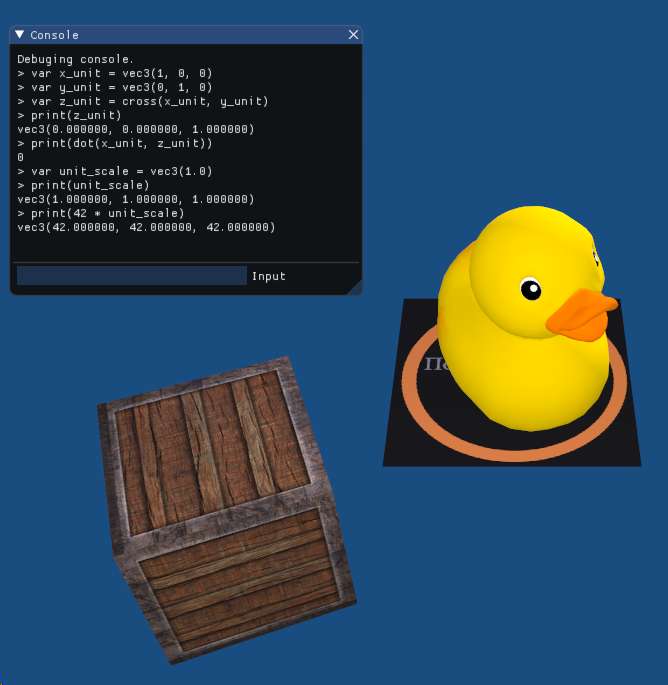

# chaiscript-glm
**This is Work In Progress and is still lacking a lot of bindings to most functions and types**

OpenGL Mathematics bindings for ChaiScript

This is a single header file that buids and return a [ChaiScript](https://github.com/chaiscript/chaiscript) module that contains binding to the [OpenGL Mathematics](https://glm.g-truc.net/0.9.9/index.html) library, intended to provide vector math capabilities to a scripting interface for 3D video game engines, using OpenGL and GLSL's conventions, but in ChaiScript.

## How to use

 1) Just setup [ChaiScript first](https://github.com/ChaiScript/ChaiScript/blob/develop/cheatsheet.md#initializing-chaiscript) in your project 
 2) Include the `chaiscript_glm.hpp` [file](https://raw.githubusercontent.com/Ybalrid/chaiscript-glm/master/chaislcript_glm.hpp) in any way you see fits your project (copy it in your code, git-submodule this repo...)
 3) call the `get_glm_module()` function, and add it to your ChaiScript instance:
 
 ```cpp
 
 #include <glm/ghm.hpp>
 #include <chaiscript/chaiscript.hpp>
 #include "chaiscript_glm.hpp"
 
 int main()
 {
  chaiscript::ChaiScript chai; //Init scripting engine
  chai.add(get_glm_module()); //Add glm
  
  // do awesome and wonderful things here!
 }
 ```
 
 This will allow you to be able to use glm as part as your scripting interface!
 
 
